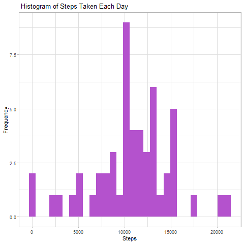
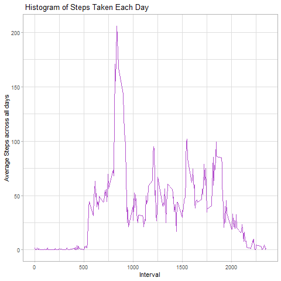
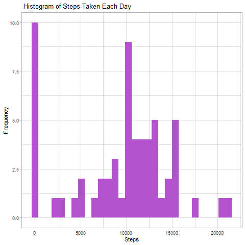
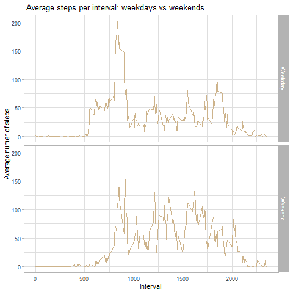

##### 
It is now possible to collect a large amount of data about personal movement using activity monitoring devices such as a 
Fitbit
, 
Nike Fuelband
, or 
Jawbone Up
. These type of devices are part of the “quantified self” movement – a group of enthusiasts who take measurements about themselves regularly to improve their health, to find patterns in their behavior, or because they are tech geeks. But these data remain under-utilized both because the raw data are hard to obtain and there is a lack of statistical methods and software for processing and interpreting the data.

This assignment makes use of data from a personal activity monitoring device. This device collects data at 5 minute intervals through out the day. The data consists of two months of data from an anonymous individual collected during the months of October and November, 2012 and include the number of steps taken in 5 minute intervals each day.


## Loading and preprocessing the data

```r
#Importing libraries required
library(ggplot2)
library(dplyr)
```

```
## Warning: package 'dplyr' was built under R version 4.3.1
```

```
## 
## Attaching package: 'dplyr'
```

```
## The following objects are masked from 'package:stats':
## 
##     filter, lag
```

```
## The following objects are masked from 'package:base':
## 
##     intersect, setdiff, setequal, union
```

```r
#Importing data
df <- read.csv("activity.csv")
```
## What is mean total number of steps taken per day?


```r
df$date = as.Date(df$date)
Total_steps <- aggregate(steps ~ date, df, FUN = sum)

ggplot (Total_steps, aes (x = steps)) + geom_histogram(fill = "mediumorchid3") +
  labs(title = " Histogram of Steps Taken Each Day ", x = "Steps", y = "Frequency") +
  theme(plot.title = element_text(hjust = 0.5)) + theme_light()
```

```
## `stat_bin()` using `bins = 30`. Pick better value with `binwidth`.
```

<!-- -->


```r
steps_mean <- mean(Total_steps$steps, na.rm = TRUE)
steps_mean
```

```
## [1] 10766.19
```

```r
steps_median <- median(Total_steps$steps, na.rm = TRUE)
steps_median
```

```
## [1] 10765
```

## What is the average daily activity pattern?


```r
Mean_steps <- aggregate(steps ~ interval, df, FUN = mean)
Mean_steps <- df %>% group_by(interval) %>% summarise(steps = mean(steps, na.rm = TRUE))
Mean_steps$steps[is.na(Mean_steps$steps)] <- 0


ggplot (Mean_steps, aes (interval, steps)) + geom_line(colour = "mediumorchid3") +
  labs(title = " Histogram of Steps Taken Each Day ", x = "Interval", y = "Average Steps across all days") +
  theme(plot.title = element_text(hjust = 0.5)) + theme_light()
```

<!-- -->


```r
max_mean_stps <- Mean_steps[which.max(Mean_steps$steps),]
max_mean_stps
```

```
## # A tibble: 1 × 2
##   interval steps
##      <int> <dbl>
## 1      835  206.
```

## Imputing missing values


```r
No_NA <- sum(is.na(df$steps))
No_NA
```

```
## [1] 2304
```

```r
df_NA <- df
df_NA$steps[is.na(df$steps)] <- 0
Total_steps_NA <- aggregate(steps ~ date, df_NA, FUN = sum)

ggplot (Total_steps_NA, aes (x = steps)) + geom_histogram(fill = "mediumorchid3") +
  labs(title = " Histogram of Steps Taken Each Day ", x = "Steps", y = "Frequency") +
  theme(plot.title = element_text(hjust = 0.5)) + theme_light()
```

```
## `stat_bin()` using `bins = 30`. Pick better value with `binwidth`.
```

<!-- -->


```r
steps_mean_NA <- mean(Total_steps_NA$steps, na.rm = TRUE)
steps_mean_NA
```

```
## [1] 9354.23
```

```r
steps_median_NA <- median(Total_steps_NA$steps, na.rm = TRUE)
steps_median_NA
```

```
## [1] 10395
```

## Are there differences in activity patterns between weekdays and weekends?


```r
df_NA <- mutate(df_NA, weekday = weekdays(date))
df_NA$day_type <- ifelse(df_NA$weekday %in% c("Saturday", "Sunday"), "Weekend", "Weekday")
df_NA_average <- aggregate(steps ~ interval + day_type, df_NA, FUN = mean)
colnames(df_NA_average)
```

```
## [1] "interval" "day_type" "steps"
```

```r
ggplot (df_NA_average, aes (interval, steps)) + geom_line(colour = "navajowhite3") +
  labs(title = " Average steps per interval: weekdays vs weekends", x = "Interval", y = "Average numer of steps") +
  theme(plot.title = element_text(hjust = 0.5)) + theme_light() + facet_grid(day_type ~ .)
```

<!-- -->

